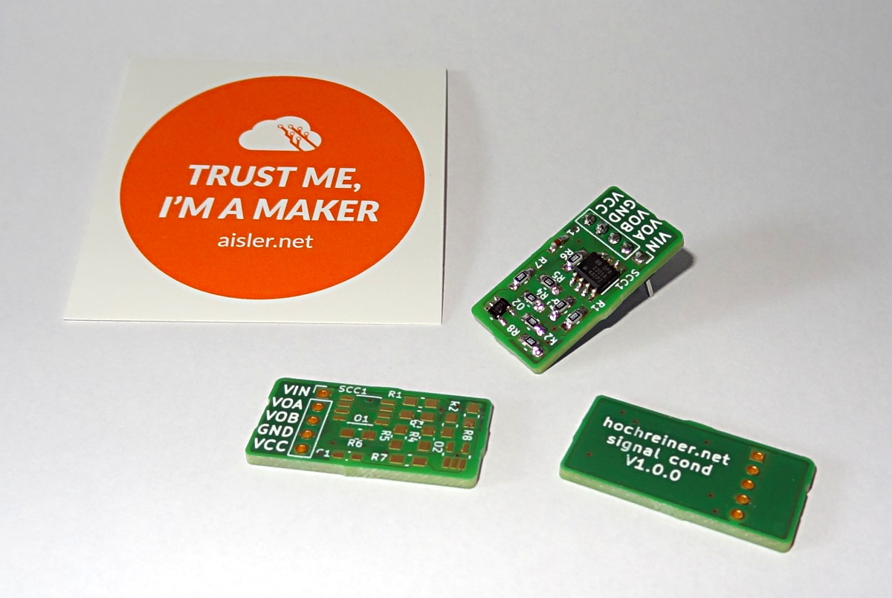
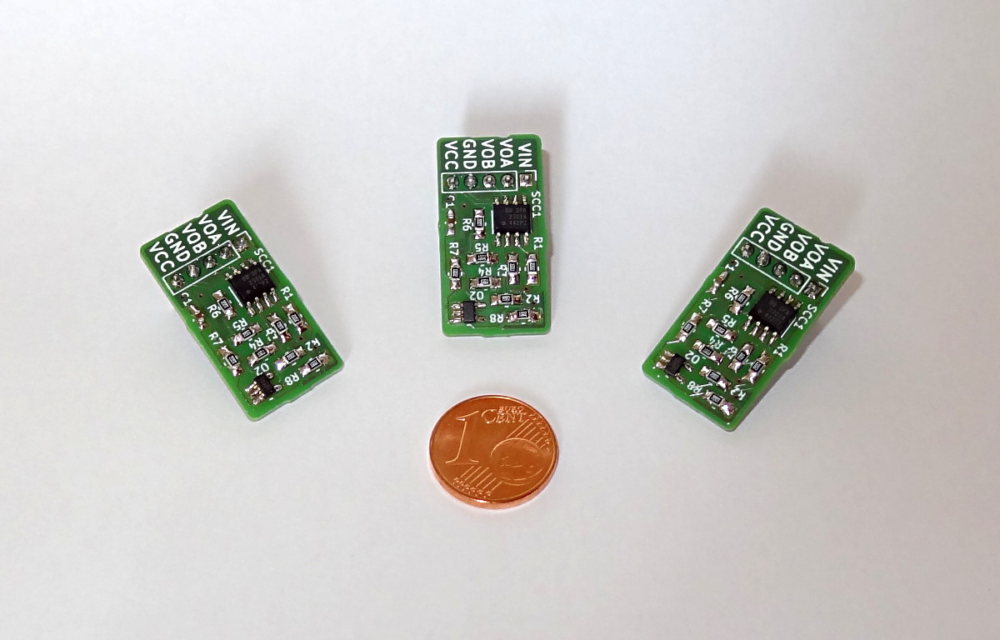

# signal-cond
A simple signal conditioning circuit based on a [TI application note by Pete Wilson](http://www.ti.com/lit/an/sboa096/sboa096.pdf).

The circuit performs a linear transform of the voltage range from +/-30V to 0-3V.
I designed this circuit to safely use piezo-electric transducer that was specified for the range of -30 to +30V.

The board and the parts can be ordered from [AISLER](http://aisler.net/p/DYDJTZVP).

The scaling factor of the circuit can be modified by changing the ratio of R1/R3 and R2/R4.
The offset can be set by changing Vref, which is dependent on the ratio of R7/R8.

